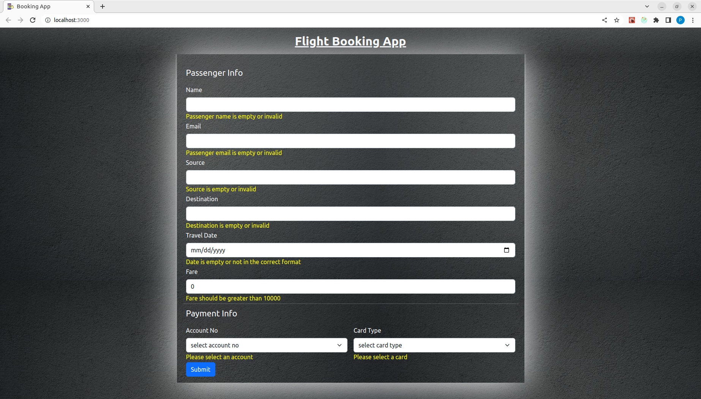
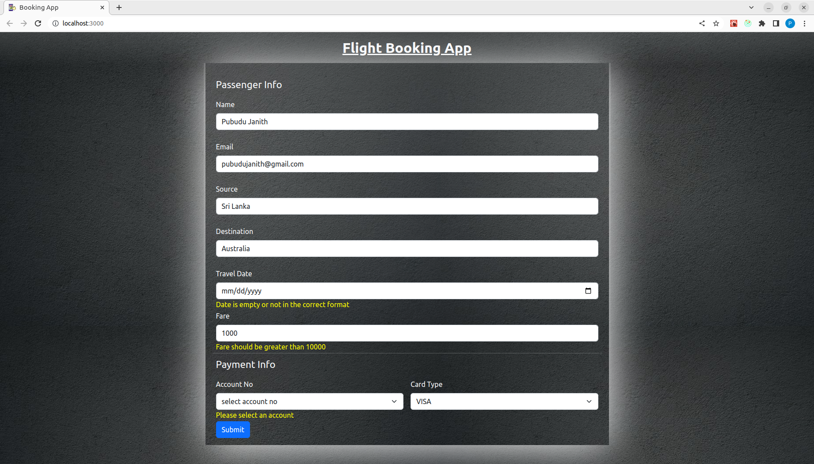
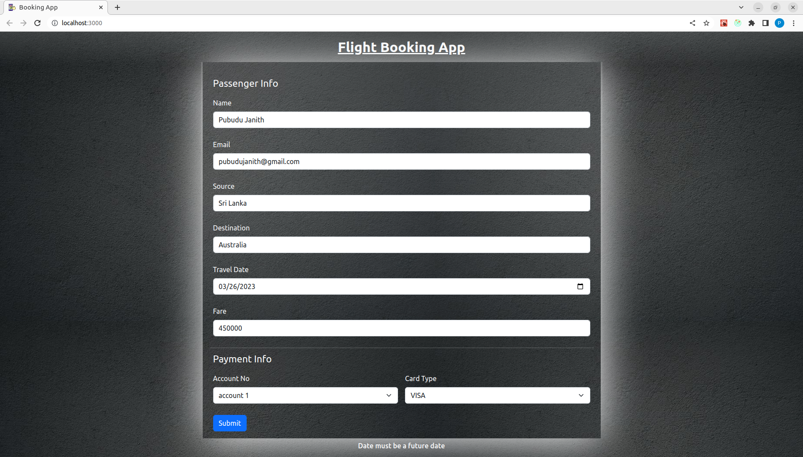
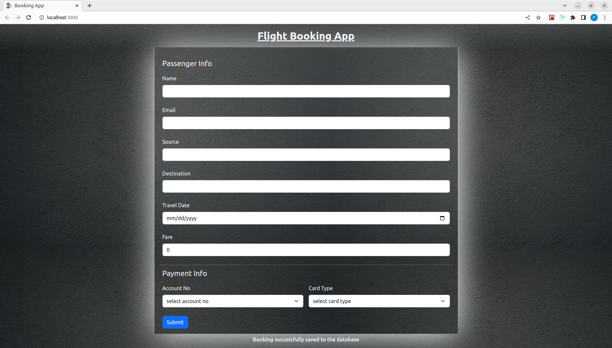

# Booking Application - Front End 

This project was bootstrapped with [Create React App](https://github.com/facebook/create-react-app).

This is the front-end part of the back-end project that demonstrate how to handle **database transactions in Spring Boot.**
This project was built with **React with TypeScript** and **Bootstrap** is used to add styling to the project. **Axios** is used to
implement the **connectivity** between backend and frontend.

See the back end of the project from [here.](https://github.com/PubuduJ/booking-application-back-end)

#### Highlighted features of the application,

- In this project, **four accounts** with the names **account 1, account 2, account 3, and account 4** are formed.

- The respective balances of these accounts are **1,200,000 LKR, 1,000,000 LKR, 800,000 LKR, and 600,000 LKR.**

- If the **booking fare** is less than the balance of the account that was sent through the Payment details, a booking has been made.
  Here, there will be **two write operations** performed on the **Passenger Info** and **Payment Info** database tables.

- Booking will not be performed and the transaction will be **rolled back** if the **booking fare** is higher than the **balance of the supplied account**.
  There won't be any **write operations** performed on the **Payment Info** or **Passenger Info** database tables.

- Travel date must be a **future date.**

- The travel fare must be in between **10000 LKR** to **1000000 LKR.**

#### Images of the user interfaces

1. Validation Error Messages 
   

2. Invalid Inputs 
   

3. Invalid Date 
   

4. Successful Reservation 
   

## Used Technologies

- React
- TypeScript
- Bootstrap
- Axios
- Redux Toolkit
- CSS3

#### Used Integrated Development Environment
- IntelliJ IDEA

## How to use ?
- This project can be used by cloning the
  project to your local computer.
- Clone the project using `https://github.com/PubuduJ/booking-application-front-end.git` terminal command.

## Available Scripts

In the project directory, you can run:

### `npm start`

Runs the app in the development mode.\
Open [http://localhost:3000](http://localhost:3000) to view it in your browser.

The page will reload when you make changes.\
You may also see any lint errors in the console.

### `npm test`

Launches the test runner in the interactive watch mode.\
See the section about [running tests](https://facebook.github.io/create-react-app/docs/running-tests) for more information.

### `npm run build`

Builds the app for production to the `build` folder.\
It correctly bundles React in production mode and optimizes the build for the best performance.

The build is minified and the filenames include the hashes.\
Your app is ready to be deployed!

See the section about [deployment](https://facebook.github.io/create-react-app/docs/deployment) for more information.

### `npm run eject`

**Note: this is a one-way operation. Once you `eject`, you can't go back!**

If you aren't satisfied with the build tool and configuration choices, you can `eject` at any time. This command will remove the single build dependency from your project.

Instead, it will copy all the configuration files and the transitive dependencies (webpack, Babel, ESLint, etc) right into your project so you have full control over them. All of the commands except `eject` will still work, but they will point to the copied scripts so you can tweak them. At this point you're on your own.

You don't have to ever use `eject`. The curated feature set is suitable for small and middle deployments, and you shouldn't feel obligated to use this feature. However we understand that this tool wouldn't be useful if you couldn't customize it when you are ready for it.

## Version
v1.0.0

## License
Copyright &copy; 2023 [Pubudu Janith](https://www.linkedin.com/in/pubudujanith/). All Rights Reserved. 
This project is licensed under the [MIT license](LICENSE.txt).